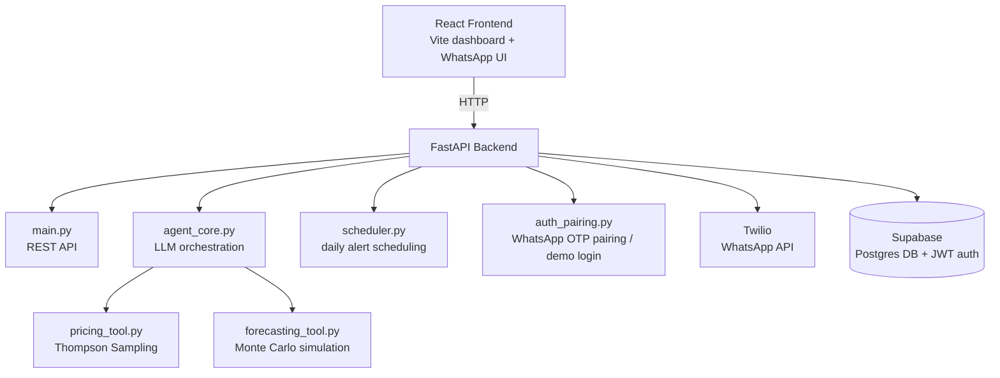

# उदय (Uday) — Bidirectional Seller Economic Twin

**Uday** is an AI "economic twin" for small shop owners, delivered entirely through WhatsApp. Instead of asking sellers to learn a dashboard, Uday watches each product's stock and sales, decides on pricing and reorder actions using statistical models, and messages the seller in plain Hindi or English on WhatsApp. A companion web dashboard shows the same data visually, plus a full transparency log of every decision the agent made and why.

---

## Table of contents

- [How it works](#how-it-works)
- [The two algorithms at the core](#the-two-algorithms-at-the-core)
- [Architecture](#architecture)
- [Project structure](#project-structure)
- [Getting started](#getting-started)
- [Environment variables](#environment-variables)
- [Running the demo without a live seller](#running-the-demo-without-a-live-seller)
- [API overview](#api-overview)
- [Testing](#testing)
- [Tech stack](#tech-stack)

---

## How it works

1. A seller signs up with their WhatsApp number and adds their products (name, stock, reorder point, cost, and an acceptable price range).
2. On a schedule, or when triggered manually, the **agent core** pulls each product's recent order history and runs it through two statistical tools — a pricing engine and a stockout forecaster.
3. Those raw statistical outputs are turned into a short, honest, natural-language message by an LLM (Sarvam or Gemini), and sent to the seller over WhatsApp.
4. Every decision — the trigger, the tool outputs, and the exact WhatsApp message — is logged and shown on the dashboard's **Agent reasoning log**, so nothing the agent does is a black box.
5. Sellers can also ask Uday direct questions ("Blue Kurti aur mehenga karein?") and get an answer grounded in their real data.

## The two algorithms at the core

### 1. Pricing — Thompson Sampling (Bayesian multi-armed bandit)

Each candidate price for a product (e.g. ₹490, ₹510, ₹530...) is treated as an "arm" of a bandit. Every time a price is used, the outcome (sale vs. no sale) updates a **Beta distribution** for that arm. To choose the next price, Uday samples a random value from each arm's current Beta distribution and picks the arm with the highest sample.

This is shown on the dashboard as a **posterior mean** and **95% credible interval** per price, along with how many times each price has been tried.

Why this approach: unlike a fixed A/B test, Thompson Sampling continuously balances *exploration* (trying prices with uncertain performance) against *exploitation* (favoring the price that's converting best) — and it does so automatically, without a human deciding when the test is "done." It naturally shifts traffic away from clearly bad prices while still occasionally re-checking them in case conditions change.

### 2. Stockout forecasting — Monte Carlo simulation

Uday estimates a **Poisson daily-demand rate** from recent order history for a product, then simulates hundreds of possible 30-day future sales paths (500 by default) against current stock to see in what fraction of those simulated futures the seller actually runs out.

This produces the **30-day stockout probability curve** on the dashboard. It also flags sudden **market shifts** — e.g. a 40%+ drop in sales versus the trailing average — which feed back into the reasoning log.

Why this approach: a simple linear projection ("X units/day, so you'll run out in Y days") hides the real uncertainty in day-to-day demand. Simulating many possible futures gives an honest probability instead of one falsely precise number, and naturally produces wider, more cautious estimates when there's limited sales history.

## Architecture



- **Frontend**: React + Vite (built on the TanStack Start/Router scaffold), Tailwind, shadcn/ui components, Recharts for the price/forecast/sales charts.
- **Backend**: FastAPI (Python), with a pure statistics layer (`pricing_tool.py`, `forecasting_tool.py`) kept separate from the LLM orchestration layer (`agent_core.py`) so the math is deterministic and independently testable.
- **Database**: Supabase (managed Postgres), storing sellers, SKUs, orders, price-arm statistics, agent actions, and conversation history. Supabase JWTs are used for auth.
- **Messaging**: Twilio's WhatsApp API sends and receives seller messages; a webhook in `whatsapp.py` handles inbound messages.
- **LLM providers**: Sarvam AI or Google Gemini (OpenAI-compatible endpoints) generate the natural-language messages sent to sellers, grounded strictly in the pricing/forecasting tool outputs.
- **Scheduler**: APScheduler runs a background tick every 15 minutes (in IST) to check which sellers are due for their daily alert.

## Project structure

```
seller-economic-twin/
├── backend/
│   ├── main.py                # FastAPI app + core REST endpoints
│   ├── agent_core.py          # LLM orchestration — ties stats tools to messages
│   ├── pricing_tool.py        # Thompson Sampling pricing engine
│   ├── forecasting_tool.py    # Monte Carlo stockout forecasting
│   ├── scheduler.py           # Background daily-alert scheduler (APScheduler)
│   ├── whatsapp.py            # Twilio WhatsApp send + webhook
│   ├── auth_pairing.py        # WhatsApp OTP pairing + demo login
│   ├── auth_utils.py          # Supabase JWT verification
│   ├── database.py            # All Postgres/Supabase data access
│   ├── demo.py                # Scripted 6-day demo runner + reset
│   ├── seed_data.py           # Seed data for the demo seller
│   ├── sku_creation.py        # Add-product validation + creation
│   ├── sku_resolution.py      # SKU lookup/matching helpers
│   ├── models.py              # Dataclasses/schemas (Seller, SKU, PriceArm, ...)
│   ├── scripts/
│   │   └── check_llm_providers.py
│   ├── requirements.txt
│   └── tests/                 # pytest suite (see Testing below)
├── frontend/
│   ├── src/
│   │   ├── components/        # Dashboard + WhatsApp UI components
│   │   ├── routes/            # TanStack Router route tree
│   │   ├── lib/                # i18n, error handling, utils
│   │   ├── api.js / apiClient.js  # Backend API client
│   │   └── mockApi.js         # Local mock API (VITE_API_URL=mock)
│   └── package.json
├── pytest.ini
└── package.json                # root-level test tooling
```

## Getting started

### Prerequisites

- Python 3.11+
- Node.js 18+
- Git
- A free [Supabase](https://supabase.com) project (for the database + JWT auth)

### 1. Clone the repo

```bash
git clone https://github.com/dishitaghuge01/seller-economic-twin.git
cd seller-economic-twin
```

### 2. Backend

```bash
cd backend
python -m venv venv
source venv/bin/activate      # Windows: venv\Scripts\activate
pip install -r requirements.txt
```

Create `backend/.env` — see [Environment variables](#environment-variables) below.

```bash
uvicorn main:app --reload --port 8000
```

Visit `http://localhost:8000/docs` for the interactive Swagger API docs.

### 3. Frontend

In a separate terminal:

```bash
cd frontend
npm install
```

Create `frontend/.env`:

```dotenv
VITE_API_URL=http://localhost:8000
VITE_SELLER_ID=riya_sharma
```

```bash
npm run dev
```

Open `http://localhost:5173`.

## Environment variables

### Backend (`backend/.env`)

| Variable | Required | Purpose |
|---|---|---|
| `SUPABASE_DB_URL` | **Yes** | Postgres connection string; the app fails to start without it |
| `SUPABASE_JWT_SECRET` | **Yes** | Used to verify Supabase auth JWTs |
| `SUPABASE_URL` | No | Supabase project URL |
| `SUPABASE_SERVICE_ROLE_KEY` | No | Only needed for admin-level Supabase operations |
| `SARVAM_API_KEY`, `SARVAM_BASE_URL`, `SARVAM_MODEL` | No | Enables Sarvam as the LLM provider for agent messages |
| `GEMINI_API_KEY`, `GEMINI_BASE_URL`, `GEMINI_MODEL` | No | Enables Gemini as the LLM provider |
| `TWILIO_ACCOUNT_SID`, `TWILIO_AUTH_TOKEN`, `TWILIO_WHATSAPP_NUMBER` | No | Needed only for real WhatsApp send/receive |
| `TWILIO_SANDBOX_JOIN_KEYWORD` | No | Twilio WhatsApp sandbox join code |
| `INTERNAL_API_KEY` | No | Shared secret for internal/service calls |
| `DEMO_LOGIN_ENABLED` | No | Set `true` to enable the no-signup demo login |
| `DEMO_SELLER_ID` | No | Which seeded seller the demo login uses (default `riya_sharma`) |

### Frontend (`frontend/.env`)

| Variable | Required | Purpose |
|---|---|---|
| `VITE_API_URL` | No | Backend URL. Set to `mock` to run the UI against a local mock API with no backend at all |
| `VITE_SELLER_ID` | No | Fallback seller ID for local development |
| `VITE_SUPABASE_URL`, `VITE_SUPABASE_ANON_KEY` | No | Only needed if wiring the frontend directly to Supabase auth |

## Running the demo without a live seller

If you don't want to onboard a real WhatsApp seller, use the built-in demo:

1. On the login screen, click **"Just came to look? View demo dashboard (Riya Sharma)"** — this uses `DEMO_LOGIN_ENABLED` to skip WhatsApp OTP entirely.
2. On the dashboard, click **"Run demo"** to step through a scripted 6-day scenario where Uday reacts to a stock depletion and a demand shock, generating real reasoning-log entries and WhatsApp messages as it goes.
3. Click **"Reset demo"** to restore the two seeded products to their original values.

## API overview

All endpoints are served from the FastAPI app in `backend/main.py`, with additional routers mounted for WhatsApp, auth pairing, and the demo flow.

| Method & path | Purpose |
|---|---|
| `GET /ping` | Health check |
| `GET /seller/me` | Get the authenticated seller's profile |
| `GET /seller/{seller_id}` | Get a seller's full dashboard state |
| `POST /seller/{seller_id}/skus` | Add a new product |
| `GET /seller/{seller_id}/sku/{sku_id}/history` | Price/order history for a product |
| `GET /seller/{seller_id}/sku/{sku_id}/forecast` | Stockout forecast for a product |
| `POST /seller/{seller_id}/message` | Send a question to the Uday agent |
| `POST /seller/{seller_id}/sku/{sku_id}/trigger` | Manually trigger an agent decision cycle |
| `POST /seller/{seller_id}/settings` | Update seller settings (e.g. alert time) |
| `GET /seller/{seller_id}/conversations` | Fetch WhatsApp conversation history |
| `POST /whatsapp/webhook` | Twilio inbound message webhook |
| `POST /whatsapp/send` | Send an outbound WhatsApp message |
| `POST /auth/start-pairing` | Begin WhatsApp OTP pairing |
| `GET /auth/demo-login` | Demo login (no OTP) |
| `GET /auth/pairing-status` | Poll pairing status |
| `POST /seller/{seller_id}/demo/start` \| `/step` \| `/reset` | Control the scripted demo |
| `GET /seller/{seller_id}/demo/status` | Current demo progress |

## Testing

```bash
# Backend (from backend/, with venv active)
pytest

# Frontend (from frontend/)
npm run test
```

`pytest.ini` (at the repo root) is configured to skip slow integration tests by default; the suite covers the agent core, pricing/forecasting tools, database layer, scheduler, auth pairing, WhatsApp handling, and the demo flow.

## Tech stack

- **Frontend**: React, Vite, TanStack Router/Start, Tailwind CSS, shadcn/ui, Recharts
- **Backend**: FastAPI, Python, APScheduler, psycopg2
- **Database & Auth**: Supabase (Postgres + JWT)
- **Messaging**: Twilio WhatsApp API
- **LLM providers**: Sarvam AI, Google Gemini
- **Statistics**: Thompson Sampling (Beta-Bernoulli bandit) for pricing, Monte Carlo / Poisson demand simulation for stockout forecasting